[](https://plugins.jenkins.io/view-job-filters)
[](https://plugins.jenkins.io/view-job-filters)
[](LICENSE)
[](https://ci.jenkins.io/blue/organizations/jenkins/Plugins%2Fview-job-filters-plugin/branches)
[](https://javadoc.jenkins.io/plugin/view-job-filters/)

# Jenkins View Job Filters Plugin

Manage multiple views and hundreds of jobs much more easily. This plug-in provides more ways to
include/exclude jobs from a view, including filtering by SCM path, and by any job or build status type, as well
as "chaining" of filters and negating filters.

Create smart views with exactly the jobs you want. Your smart views can
automatically include or exclude jobs by using things like the SCM path
or type, the job type, build statuses or trends or triggers, relevance
to the logged-in user, email recipients, Maven configuration, job
parameterization, and user permissions. Mix and match filters to narrow
down to exactly what you want.

# What is the "View Job Filters" plugin?

This plugin provides a number of filters that you can ["chain" together](docs/match-type.md)
to provide a much easier way to create views to organize hundreds of
jobs.  For each filter type, you can add multiple filters, and combine
them with filters of other types.  For example, you can create a view of
all your nightly jobs except those not under any SCM.  In a nutshell,
this plugin provides the following:

-   Create view to manage hundreds of jobs by [mixing-and-matching filters](docs/match-type.md)
    to include exactly the jobs you want
-   Use regular expressions
    to match against your choice of
    -   Job name or description
    -   Job's SCM Configuration path
    -   Email recipients for build
    -   Maven configuration for the job
    -   Chron Trigger
-   Filter Parameterized Jobs by their configured parameters
-   Create views relevant to the logged in user
-   Also filter by
    -   SCM Type
    -   Job Type
    -   Job or Build Status
        or Status trends
        and triggers over a duration
    -   Jobs in another View
    -   User permissions for Jobs
-   Upstream/Downstream jobs
-   Filter out all but the most recent jobs
-   Use the [Build Filter (Wrapper) Column](docs/build-filter-wrapper-column.md)
    to render your favorite columns with the relevant builds.

Also, see [this Cloud Bees write-up](https://www.cloudbees.com/blog/controlling-what-you-see-view-job-filters-jenkins-plugin)
of the View Job Filters plugin.

# How do I get started?

-   Install the plugin
-   If needed, create a new view (besides the All view) by clicking the
    "+" tab
    -   You might optionally want to see [Editing or Replacing the All View](https://github.com/jenkinsci/compact-columns-plugin/blob/master/docs/the-all-view.md) -
        the default "All" view is not editable
-   If editing an existing view, click the "Edit View" link (won't be
    available for the "All" view)
-   You will see the following button in the "Job Filters" section.
    Click it to select and add the filter type(s) you want.
    

# Regular Expression Job Filter

With a large organization and hundreds of jobs, it will become very
annoying and time-consuming to try to keep your views organized.  The
regular expression job filter can help, and there are multiple options
to choose from to make it easier.

-   **Include/Exclude options** - ability to either add jobs or filter
    out jobs based on the expression, or the negation of the expression
-   **Job name** - allows you to filter out jobs when you have naming
    conventions.  Also allows you to "narrow down" other filters, or to
    match the negation of an expression
-   **Job description** - if you use descriptions, this may help you get
    what you want
-   **SCM Configuration** - this one is perhaps the best bang for the
    buck - put in something like ".**/my-office-name/.**" to
    automatically include all jobs that are organized under source
    control already by office.
-   **Maven Configuration** - looks at all your Maven goals, including
    freestyle projects, matrix (multi-configuration) projects, Maven
    projects, and Maven extra steps.
-   **Email Recipients** - a great way to organize views by "who cares
    about this job".  Will look in either the standard email publisher
    or the [extended email publisher](https://plugins.jenkins.io/email-ext/)
-   **Job Schedule** - searches the chron spec and description to group
    jobs by when they run - for example "weekend jobs"
-   **Node/Slave Label** - matches against the Label Expression under
    the "Restrict where this project can be run" option

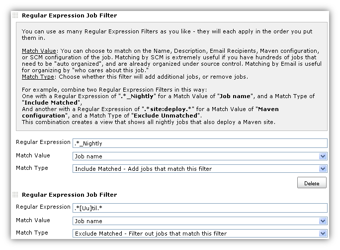

# Filter by Relevance to Logged-in User

Create views that are most relevant to the logged-in user.

The "**Name Matching**" checkbox items are to allow you to get the name
matching just right. The problem is that organizations often have
different naming conventions that may not be consistent across version
control, network logins, and email addresses. All of the options are
checked by default so that this filter can make a thorough effort to
find matching users.

The "**Relevance Matching**" options should be self explanatory. The
point is to try and find all jobs that the logged in user cares about,
based on their activity.

For the "How far back to check" value, use either "0" or blank to
indicate you want to check all builds.

Note that not all combinations of criteria will make sense. Also take a
look at the User permissions for Jobs
filter.

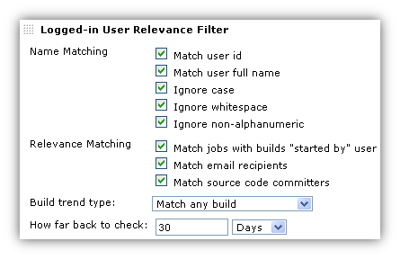

# Filter by Job Statuses

This filter provides a number of options, and you can also add multiple
of these filters, and choose different Match Types to include/exclude
exactly the jobs you want.  For example, you could create "Failed Jobs
Only" and "Unstable Jobs Only" views, or make a more complicated view
like the following example combination.

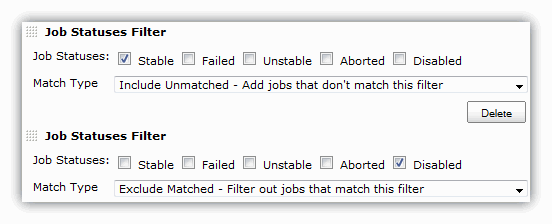

# Filter by Build Statuses

This filter gets a little more specific, and provides options to filter
by the status of the job's builds.  This example filters out (excludes)
all jobs that have never built.

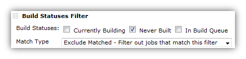

# Filter by Build Trend

This filter is similar to the build status filter, but it takes into
account the time in which the status changed.

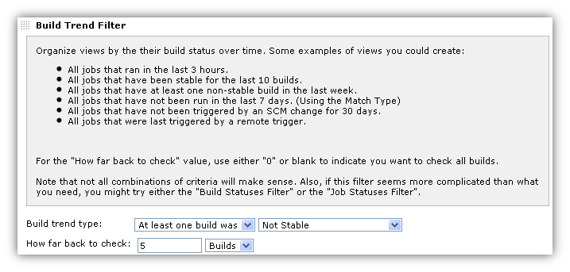

The different Build trend types are

-   The latest build was
-   At least one build was
-   All builds were
-   Completed, Started, Stable, Unstable, Failed, Not Stable
-   Triggered by Timer, SCM, User, Remote, Upstream Job, CLI

The different "how far back to check" types include, "Days", "Hours" and
"Builds".

# Filter by SCM Type

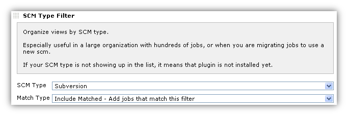

# Filter by the Jobs in Other Views

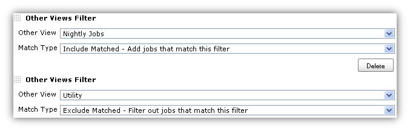

# Filter by Job Parameterization

Use Regular Expressions to include or exclude parameterized jobs based
on their build parameters.
Match the parameter name, build value, or description. Alternately, you
may opt to depend on the default configured value.

For the name, value, and description - a blank indicates you do not care
about that field - it behaves as if you had assigned it the regular
expression ".\*".

This filter works with String, Boolean, File, Choice, and Validating
String parameter types.

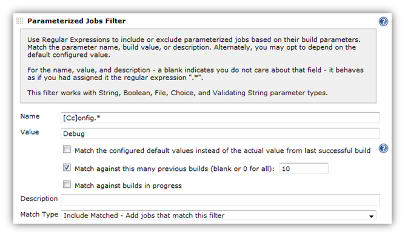

# User Permissions for Jobs

Use this feature in tandem with security features such as the [Standard matrix based security](https://jenkins.io/doc/book/managing/security/)
to create views that show different jobs depending on who is logged in.

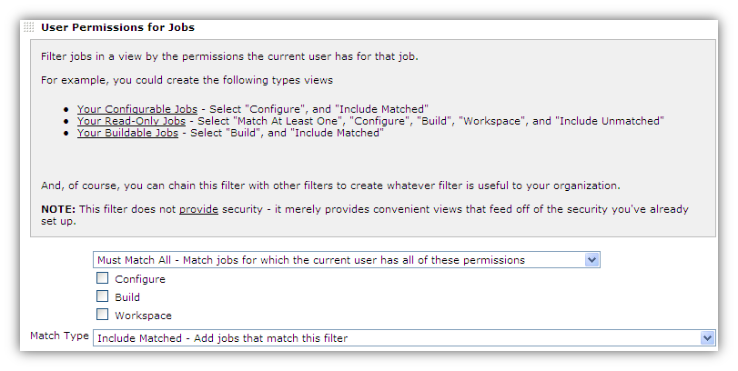

# Filter jobs that have enabled project-based security

This filters on whether a job is secured through the "Project-based
Matrix Authorization Strategy".

# Upstream/Downstream Jobs Filter

This filter allows you to create a view consisting of jobs that are
related through the concept of Upstream/Downstream (also called "Build
after other projects are built" and "Build other projects").
The options provided allow you to choose exactly which types of related
jobs to show.

Note that filters are chained together, so using this filter builds off
of the jobs included by previous filters. Remember that

-   This filter will not include any jobs if there are no jobs already
    selected
-   This filter (like most other filters) is capable of removing jobs
    that were already selected

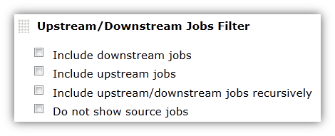

# Filter to Most Recent Jobs

Combine this filter with other filters to choose not only the exact
types of jobs to show, but how many of them to show.

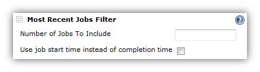

# Showing All Jobs with the "All Jobs" Filter

The All Jobs view by default shows all jobs, but all other views require
you to either select the jobs you want to include, or add a regex of
".\*" to select all jobs always.  This filter does this for you.  This
mostly useful if you're creating multiple "All Jobs" views, or replacing
the default view, and would like to customize the columns, and would
simply like to have each of those views show all jobs.

# The Build Filter (Wrapper) Column.

This column is an integral part of creating a smart view that shows just
the jobs you want, and just the builds for those jobs that you want.
Full documentation is found on the [Build Filter (Wrapper) Column](docs/build-filter-wrapper-column.md)
page.

# Roadmap

### Version 1.x (Ideas)

These features are not entered as JIRA tickets because technically no
one is requesting them.  If you want one of these features, please
enter a JIRA ticket.

-   Retrofit existing filters to be default extensions (like the way
    columns work).  Justifications are
    -   Allow for other views besides list view to more easily make use
        of them (for example, the status filter wasn't picked up by
        other views)
    -   Minor benefit is that if you have hundreds of jobs, your view
        edit screen is cluttered by the list of jobs when all you wanted
        was a regex or a status.  So, you could delete any filters you
        don't want to see and they won't show up again.  Another
        strategy to handle this might simply be a checkbox titled "hide
        view list".  However, this would obscure the fact that often a
        job is added to a view accidentally by clicking the "new job"
        link while on that view.
-   Update other views to use the extension.  Currently only used by
    ListView.  Some views extend ListView (and do an include with
    jelly), so they can't be updated unless they update to newer
    ListView.  Not sure about other views - will need to take time and
    look at each.
-   Filter on other "descriptive" things besides job name.  Large
    organizations will have other things that distinguish jobs
    automatically, but Job name isn't always one of those things
    -   Maven group id (not sure how practical this is)
    -   SCM - add more scms besides cvs and svn - need to test and
        determine best way to make those scms "optional".
    -   "java package" - could do by looking at file path?
-   More status filter options
    -   Last time built - i.e. in the last X days (very useful for
        managing hundreds of jobs that should run nightly, but sometimes
        are misconfigured, etc.)
    -   Number of days/builds stable
    -   Build duration (e.g. for a "long running builds" view)
-   Other views filter improvements/fixes
    -   Proper handle of deletes
    -   ditto for renames
    -   Don't allow a view to recursively include itself (currently
        doesn't break if you do, but it shouldn't even be an option)
-   Filter by scheduling types
    -   Filter by all jobs that have polling and/or forced timed builds
        setup - e.g. "Manual Jobs" and "Scheduled Jobs"
        -   And/or Filter by jobs last built manually/polled/forced
    -   Filter by jobs that will soon be built (or SCM polled?)

# Changelog

For new versions, see [GitHub Releases](https://github.com/jenkinsci/view-job-filters-plugin/releases).

For old versions, see the [old changelog](docs/old-changelog.md).

## Development

* Start a local jenkins instance with the view-job-filter plugin included:

```
$ mvn hpi:run
```

* Run tests and create a code coverage report:

```
$ mvn test jacoco:report
```

  The code coverage will be in `target/site/jacoco/index.html`.

* Before submitting a pull request, run a full build including integration tests and findbugs:

```
$ mvn install
```

* Publish a release (only for maintainers):

```
$ mvn release:prepare release:perform
```

## License

MIT License

## Links

* [Jenkins CI](https://ci.jenkins.io/job/Plugins/job/view-job-filters-plugin/) ([Blue Ocean](https://ci.jenkins.io/blue/organizations/jenkins/Plugins%2Fview-job-filters-plugin/branches))
* [Plugin Site](https://plugins.jenkins.io/view-job-filters)
* JIRA: [Unresolved Issues](https://issues.jenkins-ci.org/issues/?filter=18844) | [All Issues](https://issues.jenkins-ci.org/issues/?filter=18843)
