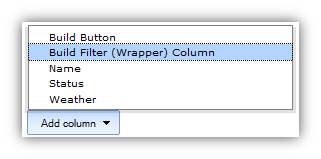
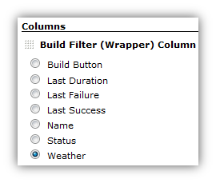

Note!

This column is not a plugin - it is part of the View Job Filters
plugin. It has its own page to help make the documentation more clear.

# What is the Build Filter (Wrapper) Column?

The use case for this column has come up numerous times in emails, JIRA
tickets, or comments on this wiki. What users want is "smart views" that
not only show just certain jobs, but only the right builds for those
jobs.

For example, let's say you have a couple dozen jobs, and each of them is
parameterized in similar ways - for example, you can pass a "Line of
Business" code as a parameter when you click "build". You can then
create two different views that will only show jobs that get run against
specific Lines of Business codes. This helps to distinguish how those
jobs are being used. However, what users want is a view that not only
shows jobs that are run against a particular line of business, but they
want that view's columns to show information that is relevant just to
the builds that were performed with that specific Line of Business code.

That same pattern applies to several of the View Job Filters, but
is most applicable to "filtering parameterized Jobs by their configured parameters"
and "creating views relevant to the logged in user".

# How do I use it?

Before getting started with this column, create your smart-view with the
right filters. The View Job Filters page
has all the instructions you will need. Test out that your view is
behaving as you want it to.

Once you've decided which columns you want to show up in your view, you
will need to create those columns one at a time, and "wrap" the
appropriate columns in a Build Filter (Wrapper) Column.

Start by scrolling down to the "Columns" section at the bottom of the
view configuration page. Decide which columns you would like to have for
your view. Then, for each column that you want to show filtered results,
first select the "Build Filter (Wrapper) Column"...

and then choose the column to filter from the radio button group shown.

In this example, the column will show the weather column exactly like
normal, except the weather will be calculated only off of the filtered
builds.

# What columns can it wrap?

This column is intended to wrap other columns that are rendered based
off of a job's builds. For example, these columns have been tested and
have the described behavior

-   Status column - will show the status of the last relevant build
    instead of the very last build
-   Weather column - calculates weather based on relevant builds instead
    of all builds
-   Last Success, Failure, Duration columns - instead of showing the
    "last" information, will show for the last relevant build
-   [Compact Columns](https://plugins.jenkins.io/compact-columns/)
    -   Job Name - will show the right markup and hover descriptions
        based on the filter
    -   Job Status - will show statuses only for the filtered builds

# Limitations

-   I haven't tested this against every column out there. So far, it
    looks like it works pretty well, but it depends heavily on columns
    making use of the "job" field that is passed to the column's jelly
    script.
-   This column doesn't do anything if it wraps columns that don't care
    about builds. For example, the default "Job Name" column won't be
    affected. However - the [Compact Columns](https://plugins.jenkins.io/compact-columns/)
    decorated Job Name column is affected, because it colors the job
    name based on the build status, and it provides hover-text of the
    latest build.
-   This column only works on list views.
-   Any column that has a link to something like "lastBuild" or
    "lastFailedBuild" - these links are not "filtered" and will link to
    exactly what they say they will, which might not be what you're
    expecting. Right now there is no easy way to fix this.
-   If any of these limitations are a problem for you, please enter a JIRA ticket.
